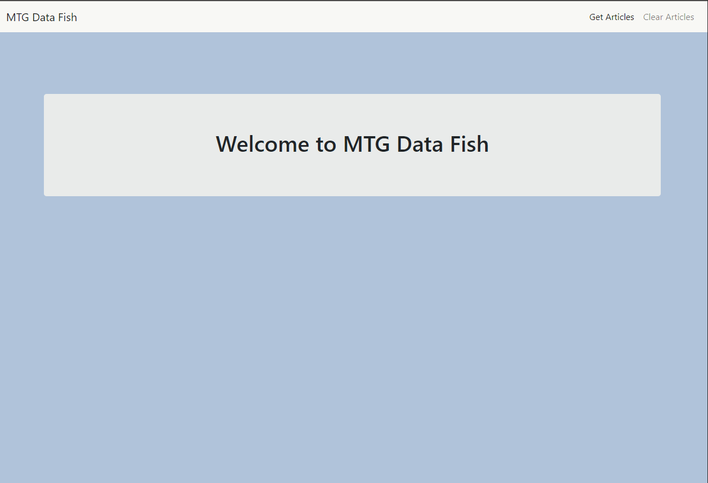
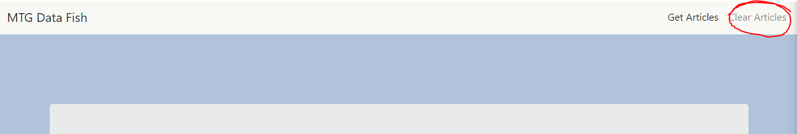
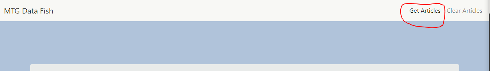
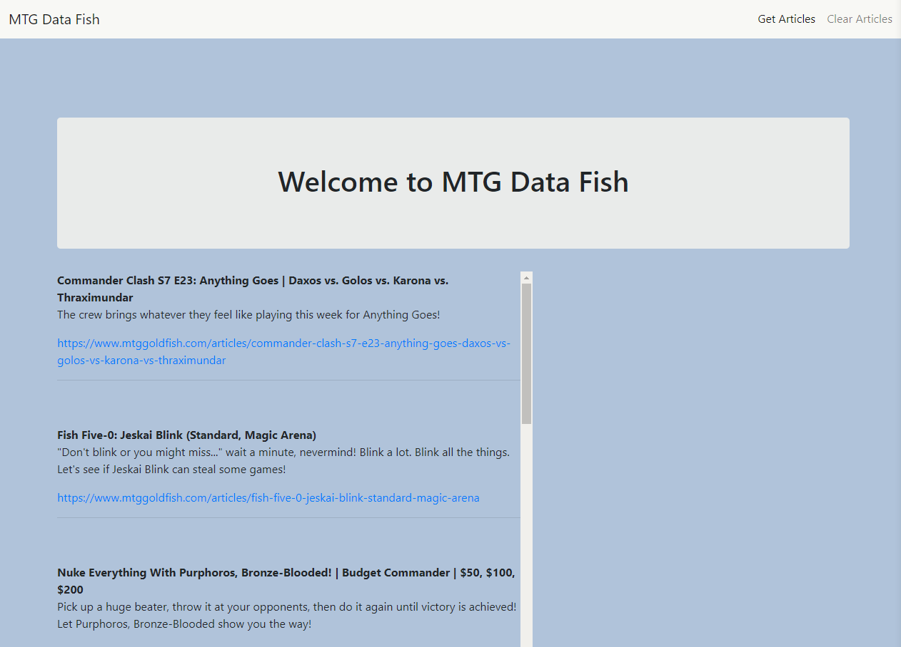
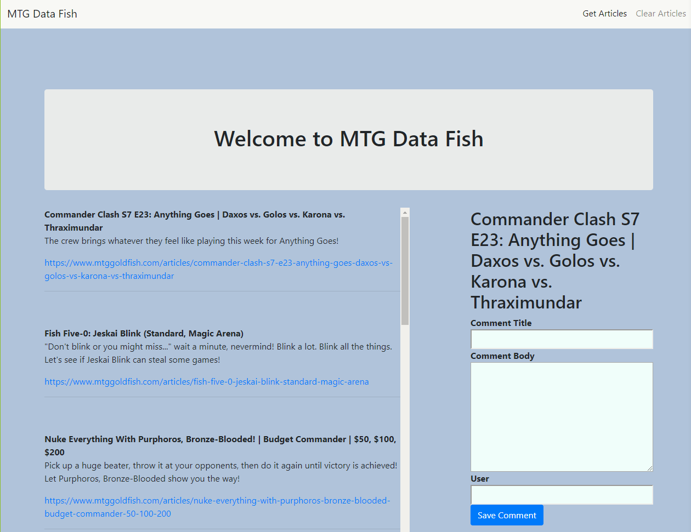
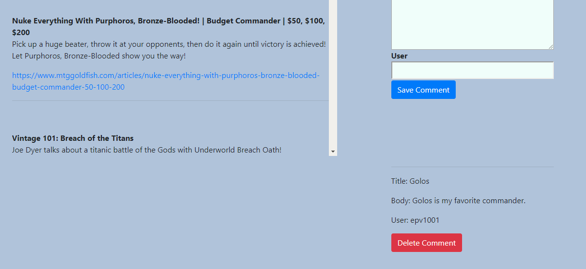
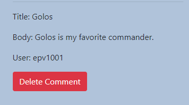

# MTG Data Fish

This app will allow the user scrape current articles from MTGGoldfish and then comment on articles.

## Overview

Welcome to MTG Data Fish! Using this app the user can scrape current articles relating to Magic the Gathering. Once the user has these articles they can then click on an article to leave a comment. They can also delete a comment from the database.

## Instructions

### Heroku Instructions

1. Navigate to the heroku page for the app using the link at the bottom of this README.
* https://mtgdatafish.herokuapp.com/

2. You should be redirected to a new page that looks as follows.  
  

3. If articles are already on the page click the "Clear Articles" button to clear the database so you can pull the most current articles to the webpage.
 

4. When ready to scrape for current articles click the "Get Articles" button. This is scrape the articles and refresh the page with the most current articles.

* Button  
 

* Articles  
 

5. If the user would like to comment on an article all this is needed is for them to click the title or body of an article and a form will appear on the right side for them to fill out then click "Save Comment."
 

6. After a comment is saved it will appear towards the bottom of the page under the form used to submit the comment.
 

7. To remove a comment click the delete comment button and it will be removed from the database.  
 

## Links

### Heroku Page

https://mtgdatafish.herokuapp.com/

### Git-Hub Page

https://github.com/EricVincitore/mongoose-hw

## Technologies Used

* HTML5
* Bootstrap
* Javascript
* Node.js
* Handlebars
* Express
* Heroku
* Mongo DB
* Mongoose

## Development Role

This app was developed by Eric Vincitore.